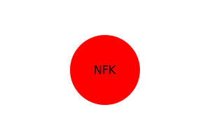

# nodejslogomkr

Create your own logo using this application in your terminal 

## Desciption

This application will allow you to create your own SVG file 3 letter logo.

## Live demo

https://youtu.be/HniglXZvcwE

File in demo:

## Licenses

https://choosealicense.com/non-software/